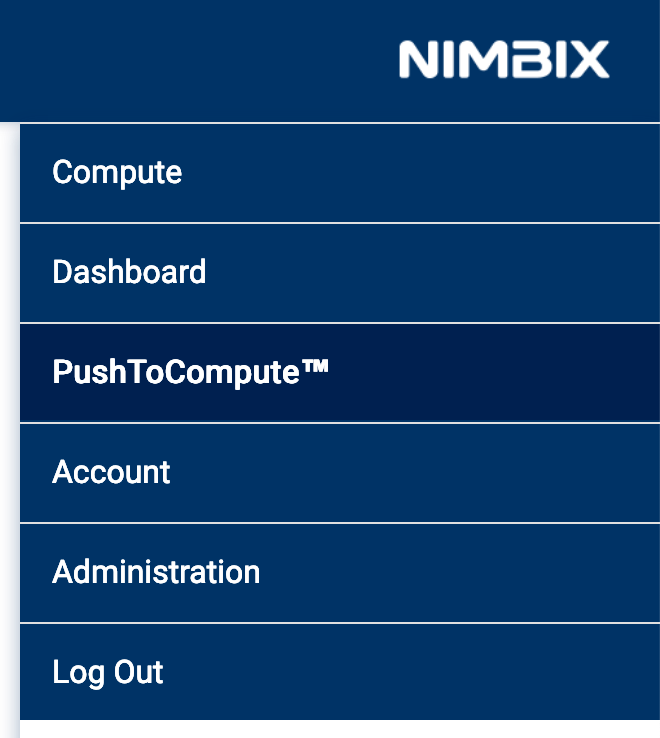
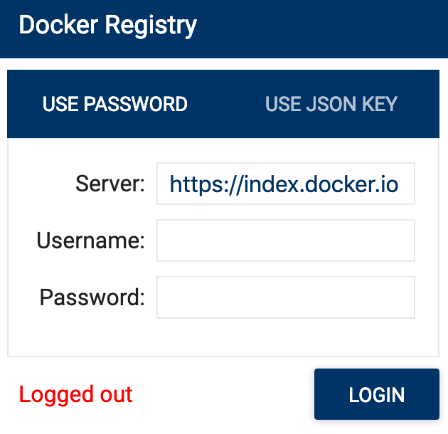
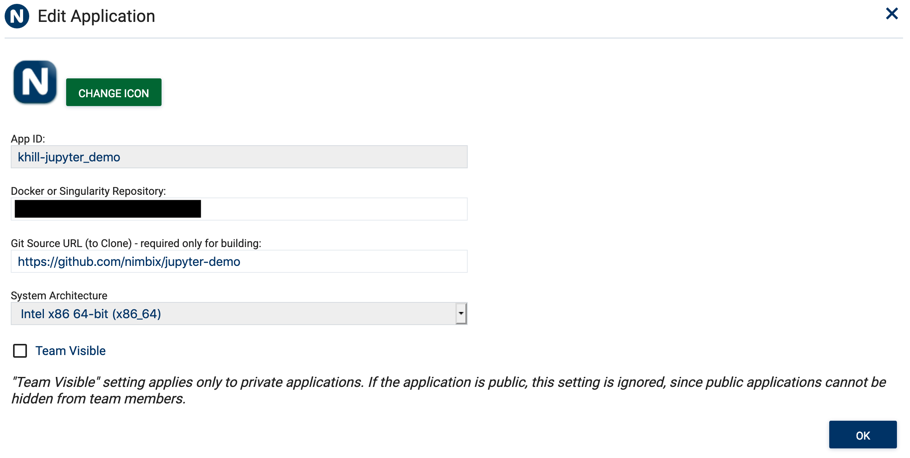
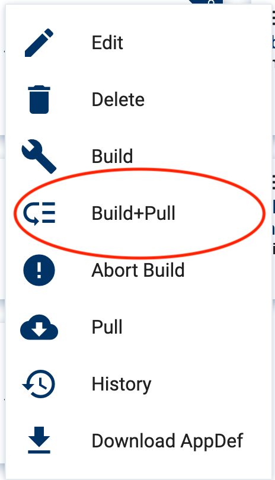
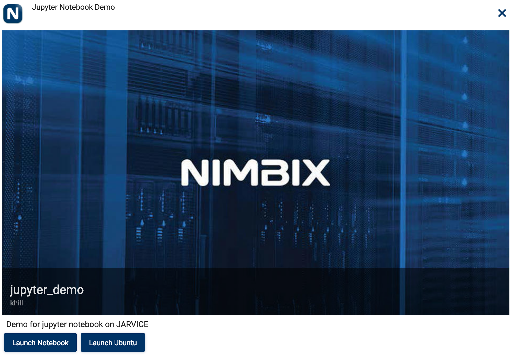

# Jupyter Demo 

Example Jupyter notebook App for JARVICE using authentication tokens

This application demonstrates how to use token substitution in a JARVICE [Appdef](https://jarvice.readthedocs.io/en/latest/appdef/) file. JARVICE currently supports:

* %RANDOM16%  := 16  bit token
* %RANDOM32%  := 32  bit token
* %RANDOM64%  := 64  bit token
* %RANDOM128% := 128 bit token

The token is available at `/etc/JARVICE/random128.txt` inside a running job. The token can be truncated to match the substitution size. For example:

```
random16=$(cat /etc/JARVICE/random128.txt | cut -c 1-16)
```

## Getting Started

These instructions will walk through how to create Jupyter notebook app for JARVICE via [PushToCompute](https://jarvice.readthedocs.io/en/latest/cicd/) CICD flow.

### Prerequisites

What things you need to install the software and how to install them:

* Docker CE: https://docs.docker.com/install/

Accounts:

* Docker repository (e.g. [DockerHub](https://hub.docker.com))
* PushToCompute enabled JARVICE account: https://www.nimbix.net/contact-us/

## Create JARVICE App using Build+Pull

1) Open the PushToCompute tab on [JARVICE](https://platform.jarvice.com)



2) Create a new JARVICE App


3) Log into Docker registry



4) Fill in App details



Note: Fill in Docker Repository using your account (e.g. `username`/jupyter-demo:xenial)

5) Start Build+Pull



## Test App

1) Click on App card

2) Select `Launch Notebook`



3) Submit job w/ `SUBMIT` button

## Authors

* **Kenneth Hill** - *Initial work*

## License

This project is uses an OpenSource license - see the [LICENSE.md](LICENSE.md) file for details

